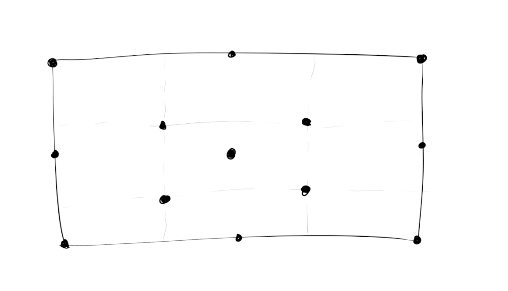

# gen-93

This one uses shapes drawn between random points chosen from a limited set of fixed screen positions.

                                                       
Two points are chosen and drawn with (weighted) random shapes and a gradient background chosen from a random palette.

Several of these shapes are set up and then filled with "evenodd" / xor-filling with that gradient. And then overlayed 
with one of more layers of the same.

The basic concept has been ready for some time and I have been testing several attempts of creating more textured outputs.

Still WIP
